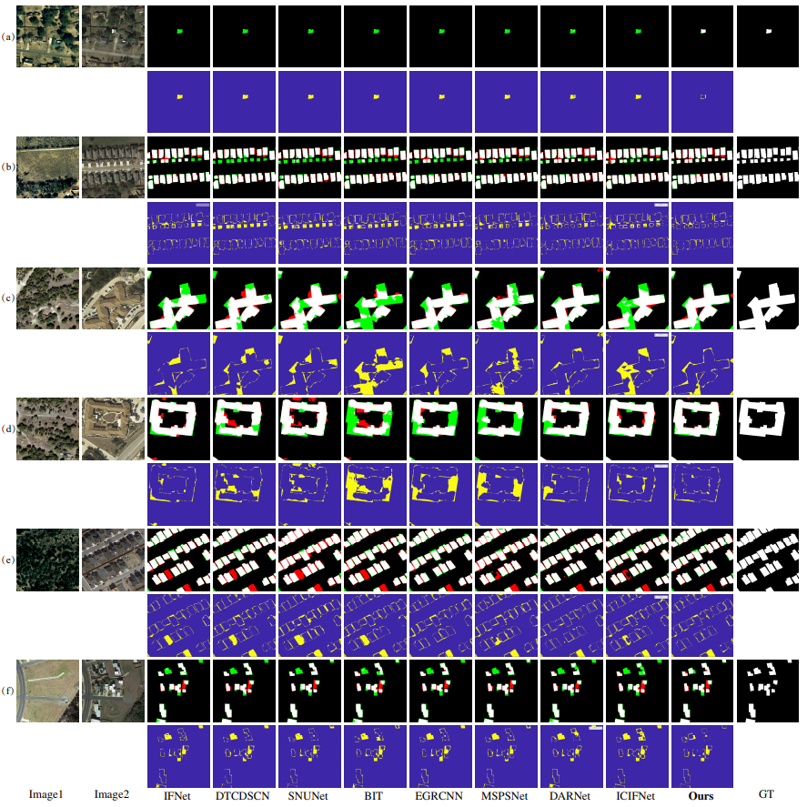

# CICNet

## Papers
* Compact Intertemporal Coupling Network for Remote Sensing Change Detection (ICME 2023) 


## 1. Environment setup
This code has been tested on on the workstation with Intel Xeon CPU E5-2690 v4 cores and two GPUs of NVIDIA TITAN V with a single 12G of video memory, Python 3.6, pytorch 1.9, CUDA 10.0, cuDNN 7.6. Please install related libraries before running this code:

    pip install -r requirements.txt

## 2. Download the datesets:
* LEVIR-CD:
[LEVIR-CD](https://justchenhao.github.io/LEVIR/)
* WHU-CD:
[WHU-CD](https://study.rsgis.whu.edu.cn/pages/download/building_dataset.html)
* GZ-CD:
[GZ-CD](https://github.com/daifeng2016/Change-Detection-Dataset-for-High-Resolution-Satellite-Imagery)
* SYSU-CD:
[SYSU-CD](https://github.com/liumency/SYSU-CD)

and put them into `datasets` directory. The directory should be organized as follows: 

```
"""
Change detection data set with pixel-level binary labels；
├─A
├─B
├─label
└─list
"""
```

`A`: images of t1 phase;

`B`:images of t2 phase;

`label`: label maps;

`list`: contains `train.txt, val.txt and test.txt`, each file records the image names (XXX.png) in the change detection dataset. 

And change the `root_dir` in the `data_config.py` file.

## 3. Download the models (loading models):

Download the pretrained 'ResNet18' model and put it into `pretrained` directory.

And the pretrained models of CICNet on four CD datasets are as follows: 

* [models](https://pan.baidu.com/s/15xhoSqrZ3ho3hC5WNa1liA) code: loph

and put them into `checkpoints` directory.

## 4. Train
You can find the training script `run_cd.sh` in the folder `scripts`. You can run the script file by `sh scripts/run_cd.sh` in the command environment.

The detailed script file `run_cd.sh` is as follows:

```cmd
gpus=0
checkpoint_root=checkpoints 
data_name=LEVIR  # dataset name 

img_size=256
batch_size=8
lr=0.01
max_epochs=200  #training epochs
net_G=CICNet # model name
lr_policy=linear

split=train  # training txt
split_val=val  # validation txt
project_name=${net_G}-${data_name}

python main_cd.py --img_size ${img_size} --checkpoint_root ${checkpoint_root} --lr_policy ${lr_policy} --split ${split} --split_val ${split_val} --net_G ${net_G} --gpu_ids ${gpus} --max_epochs ${max_epochs} --project_name ${project_name} --batch_size ${batch_size} --data_name ${data_name}  --lr ${lr}
```

## 5. Evaluate
You can find the evaluation script `eval.sh` in the folder `scripts`. You can run the script file by `sh scripts/eval.sh` in the command environment.

The detailed script file `eval.sh` is as follows:

```cmd
gpus=0
data_name=LEVIR # dataset name
net_G=CICNet # model name 
split=test # test.txt
project_name=${net_G}-${data_name} # the name of the subfolder in the checkpoints folder 
checkpoint_name=best_ckpt.pt # the name of evaluated model file 

python eval_cd.py --split ${split} --net_G ${net_G} --checkpoint_name ${checkpoint_name} --gpu_ids ${gpus} --project_name ${project_name} --data_name ${data_name}
```
    
## 6. Results





## License
Code is released for non-commercial and research purposes **only**. For commercial purposes, please contact the authors.


* Plane Text：
	Y. Feng, H. Xu, J. Jiang and J. Zheng, "Compact Intertemporal Coupling Network for Remote Sensing Change Detection," in IEEE International Conference on Multimedia & Expo (ICME 2023).

    Y. Feng, J. Jiang, H. Xu and J. Zheng, "Change Detection on Remote Sensing Images using Dual-branch Multi-level Inter-temporal Network," in IEEE Transactions on Geoscience and Remote Sensing, doi: 10.1109/TGRS.2023.3241257.
    
    Y. Feng, H. Xu, J. Jiang, H. Liu and J. Zheng, "ICIF-Net: Intra-Scale Cross-Interaction and Inter-Scale Feature Fusion Network for Bitemporal Remote Sensing Images Change Detection," in IEEE Transactions on Geoscience and Remote Sensing, vol. 60, pp. 1-13, 2022, Art no. 4410213, doi: 10.1109/TGRS.2022.3168331.
